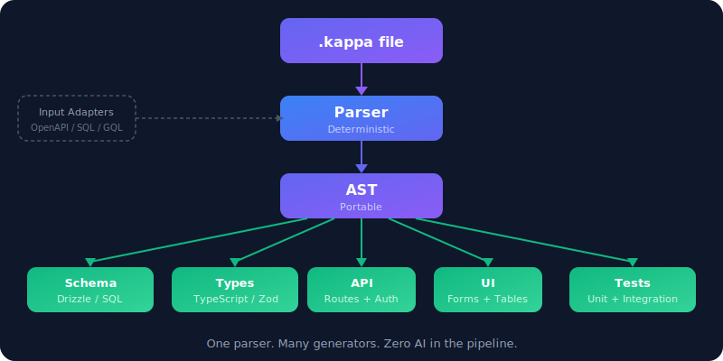

<p align="center">
  
</p>

<h1 align="center">Kappa</h1>

<p align="center">
  <strong>One file. Every layer. Zero drift.</strong>
</p>

<p align="center">
  <sub><i>Define your entire application — schema, types, validation, API, UI, and tests — in a single <code>.kappa</code> file.<br>
  Generate production code for any stack. Nothing is repeated. Nothing falls out of sync.</i></sub>
</p>

<p align="center">
  <a href="LICENSE"></a>
  <a href="spec/language.md"></a>
  <a href="CONTRIBUTING.md"></a>
</p>

<p align="center">
  <a href="spec/language.md">Language Spec</a> · <a href="spec/dense-notation.md">Dense Notation</a> · <a href="examples">Examples</a> · <a href="CONTRIBUTING.md">Contributing</a>
</p>

---

## The problem

You describe a `User` six times to ship one feature:

```
Prisma schema        →  model User { id Int @id @default(autoincrement()) ... }
TypeScript interface →  interface User { id: number; email: string; ... }
Zod validation       →  z.object({ email: z.string().email(), ... })
API route            →  router.get('/users/:id', async (req, res) => { ... })
React form           →  <input type="email" required pattern="..." />
Test fixture         →  const mockUser = { id: 1, email: 'test@example.com', ... }
```

Six files. Six chances for things to drift. Six places to update when you add a field.

For AI-assisted development, this is worse: an LLM spends 70–80% of its context window reading boilerplate before it can do anything useful.

## The fix

```kappa
User { email: s@~#email, name: s(1,100), role: (admin|editor|viewer), active: b=true, created: dt!^ }
```

One line. Five fields. Every decision is explicit: unique (`@`), indexed (`~`), format-annotated (`#email`), length-constrained (`(1,100)`), defaulted (`=true`), immutable (`!`), hidden (`^`). Fields are required by default — no `*` needed.

A parser reads this single line and generates the database column, the TypeScript type, the validation rule, the API endpoint, the form input, and the test case for every field.

**Same information. Written once. Generated everywhere.**

---

## Designed for AI-native development

Kappa was built from the ground up for LLM workflows.

**Minimal token footprint.** Every character carries meaning. No decorative syntax, no boilerplate, no repetition. An LLM can express a complete entity in a single line instead of spending hundreds of tokens across multiple files.

**Streaming parse.** The dense notation parses incrementally, token by token — no buffering, no lookahead. Each field emits a complete AST node on the comma delimiter. When an LLM streams Kappa output, code generation begins before the spec is fully written. The schema column for `email` is generated while the model is still producing the next field.

**Constrained vocabulary.** A small, precise set of type codes and modifiers means the LLM has fewer ways to be wrong. The grammar is unambiguous — there's exactly one way to express any given constraint.

---

## How it works

```
.kappa file  →  Parser  →  AST  →  Generators  →  target code
```

<p align="center">
  
</p>

The parser is deterministic. The generators are deterministic. Input adapters read existing schemas (OpenAPI, SQL, GraphQL) and produce Kappa. Output generators read Kappa and produce code for any stack. Same spec, different targets.

---

## Dense notation

The compact syntax. One entity per line.

```kappa
Product { sku: s@~(8,20), name: s(1,200), price: m(0.01,), stock: i(0,)=0, status: (draft|active|discontinued), category: Category, created: dt!^ }
```

Fields are required by default. Use `?` for optional/nullable.

**Quick reference**

| Code | Type | &nbsp; | Modifier | Meaning |
|------|------|---|----------|---------|
| `s` | String | | `?` | Optional |
| `t` | Text | | `*` | Required (emphasis) |
| `i` | Integer | | `!` | Immutable |
| `f` | Float | | `~` | Indexed |
| `m` | Decimal | | `@` | Unique |
| `b` | Boolean | | `^` | Hidden (internal) |
| `d` | Date | | `=val` | Default |
| `dt` | DateTime | | `(min,max)` | Constraint |
| `id` | Identifier | | `#fmt` | Format annotation |
| `x` | Binary | | `++` | Auto-increment |

References: `author: User` (required) &nbsp;&mdash;&nbsp; `team: Team?` (optional) &nbsp;&mdash;&nbsp; Enums: `(a|b|c)` &nbsp;&mdash;&nbsp; Named enums: `enum Role (a|b|c)` &nbsp;&mdash;&nbsp; Arrays: `[s]`

> Full reference: [Dense Notation Spec](spec/dense-notation.md)

---

## Full syntax

When you need computed fields, authorization, or workflows — things dense notation can't express:

```kappa
entity Order {
  items: [OrderItem]
  status: (pending|paid|shipped|cancelled) = "pending"

  total: Float = fn() => this.items |> sum(item => item.price * item.quantity)

  capability owner {
    scope: fn(user: User) => this.customer == user
    actions: ["read", "update", "cancel"]
  }

  workflow onUpdate {
    when this.status == "paid" then {
      notify(this.customer, "Payment confirmed")
      inventory.reserve(this.items)
    }
  }
}
```

Both syntaxes mix in the same file. Both produce the same AST.

---

## Examples

| Example | What it covers |
|---------|---------------|
| [Blog](examples/dense/user-blog.kappa) | Users, posts, comments |
| [E-commerce](examples/dense/ecommerce.kappa) | Products, orders, line items |
| [SaaS Project Manager](examples/dense/saas-multitenant.kappa) | Multi-tenant orgs, projects, tasks |
| [AI Chat Platform](examples/dense/ai-chat-saas.kappa) | Conversations, messages, tool calls, billing |
| [ML Platform](examples/dense/ml-platform.kappa) | Experiments, runs, datasets, model registry |
| [Compiler Pipeline](examples/dense/compiler-pipeline.kappa) | Source files, AST, symbols, IR, diagnostics |
| [Quantum Lab](examples/dense/quantum-lab.kappa) | Backends, circuits, jobs, calibration |
| [Order with Logic](examples/full/order-with-logic.kappa) | Computed fields, authorization, workflows |
| [Streaming Parse](examples/streaming/incremental-parse.md) | Token-by-token incremental parsing |

---

## CLI

```bash
# Parse a file and output the AST as JSON
kappa parse schema.kappa

# Validate one or more files
kappa validate src/*.kappa

# Reformat to canonical dense notation
kappa fmt schema.kappa --write
```

## Specification

- [Language Specification](spec/language.md) — complete reference
- [Dense Notation Reference](spec/dense-notation.md) — quick reference
- [Dense Grammar (EBNF)](spec/grammar-dense.ebnf) — formal grammar
- [Full Grammar (EBNF)](spec/grammar-full.ebnf) — formal grammar

---

## Roadmap

The specification is **stable**. The toolchain is under active development:

- [x] Language specification (v2 — required-by-default, implicit id, `m` decimal, `^` hidden, `#format`, named enums, `@unique`)
- [x] Dense and full syntax with unified AST
- [x] Formal EBNF grammars
- [x] Parser generator — one script produces parsers for 5 languages
- [x] Reference parsers (TypeScript, Python, Rust, Go, Java)
- [x] Streaming parser (character-by-character, emits on comma)
- [x] Cross-language test suite (116 AST tests + 13,500 property-based + fuzz)
- [x] CLI tooling (`parse`, `validate`, `fmt`)
- [ ] Input adapters (OpenAPI, SQL, GraphQL → Kappa)
- [ ] Output generators (Drizzle, Zod, tRPC, React)
- [ ] VS Code extension with syntax highlighting

## Get involved

The spec is the product right now. Read it, try writing `.kappa` files for your own domain, and [open an issue](https://github.com/owenob1/kappa/issues) with what you find.

If you want to build a parser or generator, see [CONTRIBUTING.md](CONTRIBUTING.md).

## License

[MIT](LICENSE)
